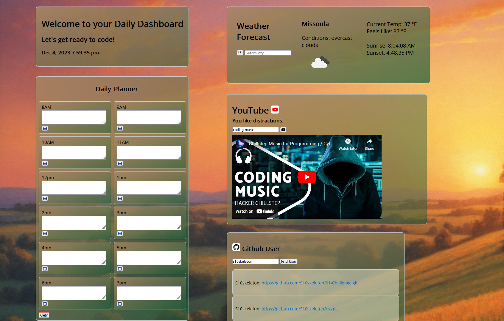

# Project-1-G5

A simple daily dashboard to get software developers ready for the day!

## Requirments 

You and your group will use everything you’ve learned over the past six modules to create a real-world front-end application that you’ll be able to showcase to potential employers. The user story and acceptance criteria will depend on the project that you create, but your project must fulfil the following requirements:

Use a CSS framework other than Bootstrap.

Be deployed to GitHub Pages.

Be interactive (i.e., accept and respond to user input).

Use at least two server-side APIs.

Does not use alerts, confirms, or prompts (use modals).

Use client-side storage to store persistent data.

Be responsive.

Have a polished UI.

Have a clean repository that meets quality coding standards (file structure, naming conventions, follows best practices for class/id naming conventions, indentation, quality comments, etc.).

Have a quality README (with unique name, description, technologies used, screenshot, and link to deployed application).

## Description

An application to help coders start their day. It provides a daily schedule, current weather for your local area, a youtube api to listen to your favorite music,
and a github API to access your recent repositories. The background image is controlled dynamically based on the time of day. 

## Links to Repository and Deplayed Application 

https://s10skeleton.github.io/Project-1-G5/

https://github.com/S10skeleton/Project-1-G5

## ScreenShot

